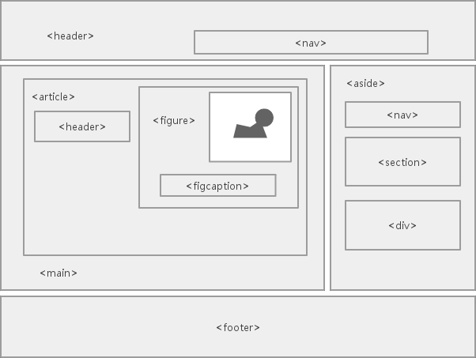

## 为什么需要语义化
* 易修改、易维护。
* 无障碍阅读支持。
* 搜索引擎友好，利于 SEO。
* 面向未来的 HTML，浏览器在未来可能提供更丰富的支持。

## 结构语义化
语义元素均有一个共同特点——他们均不做任何事情。换句话说，语义元素仅仅是页面结构的规范化，并不会对内容有本质的影响。

下图展示了一个典型的页面结构。



## 头部
`<header>`元素有两种用法，第一是标注内容的标题，第二是标注网页的页眉，如上图你看到的那样。
除非必要（内容标题附带其它信息的情况下：发布时间、作者等），一般不在内容中使用`<header>`。
因而，网页中可以包含多个`<header>`元素。
按照 HTML5 的规定，`<header>`都应包含某个级别的标题，所以应隐式或显式地包含标题，通常将不希望显示的标题设置为display: none;
一方面遵守规范，另一方面则提供了无障碍阅读而不至于影响到页面设计。

## 导航栏

导航栏使用`<nav>`看起来是理所当然的，进一步，它也用于一组文章的链接。一个页面可以包含多个`<nav>`元素，但通常仅仅在页面的主要导航部分使用它。
《HTML5：The Missing Manual》中指出了在侧栏使用`<nav>`标签的两个案例

```html
<!-- 案例一 -->
<nav>
    <!-- 此处是链接 -->
    `<aside>`</aside>
    `<aside>`</aside>
</nav>

<!-- 案例二 -->
`<aside>`
    <nav>
        <!-- 此处是链接 -->
    </nav>
    <section></section>
    <div></div>
</aside>
```

如果侧栏中包含其它不同于链接的其它区块，那么，使用第二种方案显然更为合适。

导航通常包含一组链接，普遍认为，链接使用列表来组织。

```html
<!-- 案例一 -->
<nav>
    <ul>
        <li><a href="#" title="链接">链接</a></li>
        <li><a href="#" title="链接">链接</a></li>
        <li><a href="#" title="链接">链接</a></li>
    </ul>
</nav>
```

## 附注

`<aside>`元素并不仅仅是侧栏，它表示与它周围文本没有密切关系的内容。文章中同样可以使用`<aside>`元素，来说明文章的附加内容、解释说明某个观点、相关内容链接等等。

当`<aside>`用于侧栏时，其表示整个网页的附加内容。通常的广告区域、搜索、分享链接则位于侧栏。侧栏中的`<section>`元素规定了一个区域，通常是带有标题的内容。

`<section>`标签适合标记的内容区块：

与页面主体并列显示的小内容块。
独立性内容，清单、表单等。
分组内容，如 CMS 系统中的文章分类区块。
比较长文档的一部分，可能仅仅是为了正确规定页面大纲。
`<div>`标签依然是可用的，当你觉得使用其它标签都不太合适的时候。新的语义元素出现之前，我们总是这么干的！

## 页脚
同可“包罗万象”的`<header>`元素不同，标准规定`<footer>`标签仅仅可以包含版权、来源信息、法律限制等等之类的文本或链接信息。如果想要在页脚中包含其它内容，可以使用熟悉的`<div>`来帮忙。

```html
<div>
  <aside>
  <!-- 其它内容 -->
  </aside>
  
  <footer>
    <!-- 法律、版权、来源、联系信息等 -->
  </footer>
</div>
```

## 主要内容
`<article>`表示一个完整的、自成一体的内容块。如文章或新闻报道。`<article>`应包含完整的标题、文章署名、发布时间、正文。当语义与表现发生冲突，例如有时需要将文章分多个页面显示，那么需要把每个页面的文章区域都用`<article>`标记。

文章中包含插图时，使用新的语义元素`<figure>`标签。

```html
<article>
  <h1>标题</h1>
  <p>
    <!-- 内容 -->
  </p>
  <figure>
    
    <figcaption>这是一个插图</figcaption>
  </figure>
</article>
```
上述情况下，`<figcaption>`包含了关于插图的详细解释，则``的alt属性可以略去。
