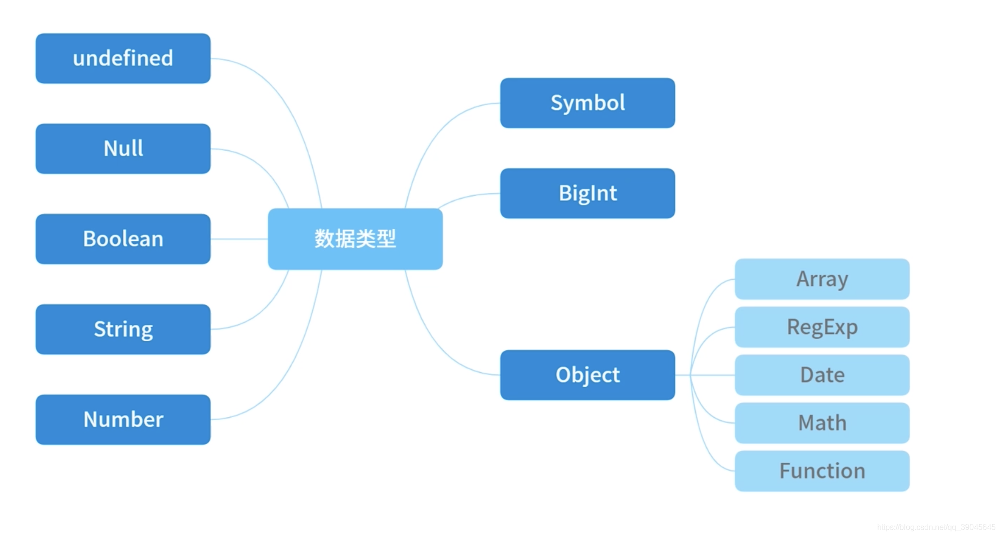

## 概念篇

### 1.JS原始数据类型有哪些？引用数据类型有哪些？

在 JS 中，存在着 6 种原始值，分别是：
* boolean
* null
* undefined
* number
* string
* symbol
* bigint
 
引用数据类型: 对象Object（包含普通对象-Object，数组对象-Array，正则对象-RegExp，日期对象-Date，数学函数-Math，函数对象-Function）




## 检测篇

###  typeof 是否能正确判断类型？

1. 对于原始类型来说，除了 null 都可以调用typeof显示正确的类型。
```javascript
typeof 1 // 'number'
typeof '1' // 'string'
typeof undefined // 'undefined'
typeof true // 'boolean'
typeof Symbol() // 'symbol'
```
2. 但对于引用数据类型，除了函数之外，都会显示"object"。
```javascript
typeof [] // 'object'
typeof {} // 'object'
typeof console.log // 'function'
```

### instanceof 运算符用于检测构造函数的 prototype 属性是否出现在某个实例对象的原型链上。

```javascript
const Person = function() {}
const p1 = new Person()
p1 instanceof Person // true

var str1 = 'hello world' // 没有创建 String 实例 所以返回 false
str1 instanceof String // false

var str2 = new String('hello world')
str2 instanceof String // true
```

#### Object.prototype.toString

1. 在JavaScript中,想要判断某个对象值属于哪种内置类型,最靠谱的做法就是通过Object.prototype.toString方法
```javascript
console.log(Object.prototype.toString.call(undefined)) // [object Undefined]
console.log(Object.prototype.toString.call(null)) // [object Null]

var date = new Date();
console.log(Object.prototype.toString.call(date)) // [object Date]
```
