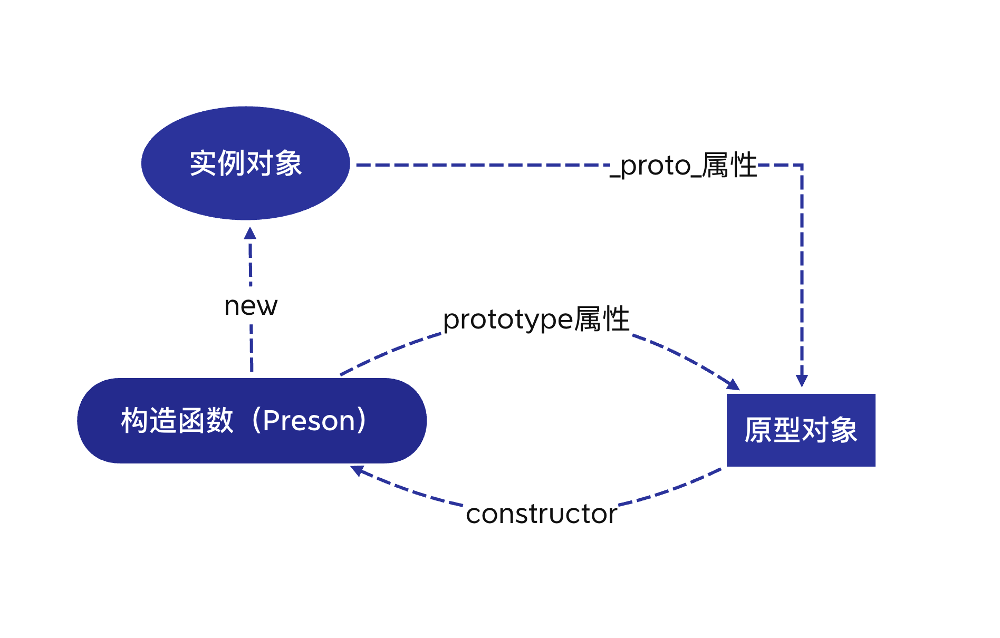
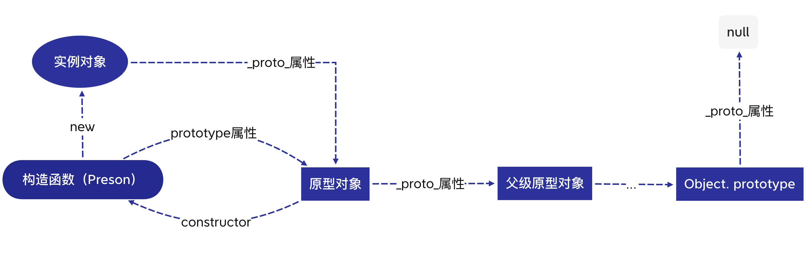

## 原型对象和构造函数有何关系？
> prototype: 原型对象
> \_\_proto\_\_: 原型链（链接点/指针）
1. 每当定义一个函数数据类型(普通函数、类)时候，都会天生自带一个prototype属性，这个属性指向函数的原型对象。

2. 当函数经过new调用时，这个函数就成为了构造函数，返回一个全新的实例对象，这个实例对象有一个__proto__属性，指向构造函数的原型对象。

3. 每个原型都有一个 constructor 属性指向关联的构造函数。

## 能不能描述一下原型链？

1. 在JavaScript里，万物皆对象，JavaScript对象通过_proto_指向父类对象，直到指向Object对象为止，这样就形成了一个原型指向的链条, 即原型链。

