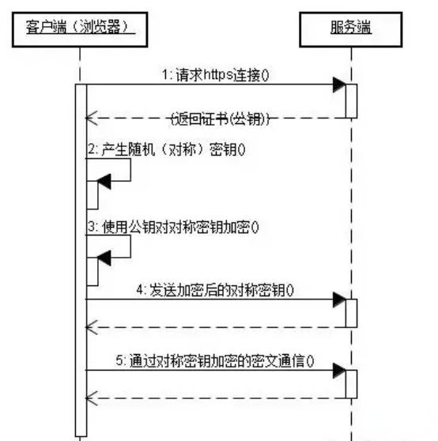

## 一般http中存在如下问题：

1. 请求信息明文传输，容易被窃听截取。
2. 数据的完整性未校验，容易被篡改
3. 没有验证对方身份，存在冒充危险

## 什么是HTTPS

HTTPS 协议（HyperText Transfer Protocol over Secure Socket Layer）：一般理解为HTTP+SSL/TLS，通过 SSL证书来验证服务器的身份，并为浏览器和服务器之间的通信进行加密。

## 那么SSL又是什么？

1. SSL（Secure Socket Layer，安全套接字层）：1994年为 Netscape 所研发，SSL 协议位于 TCP/IP 协议与各种应用层协议之间，为数据通讯提供安全支持。

2. TLS（Transport Layer Security，传输层安全）：其前身是 SSL，它最初的几个版本（SSL 1.0、SSL 2.0、SSL 3.0）由网景公司开发，1999年从 3.1 开始被 IETF 标准化并改名，发展至今已经有 TLS 1.0、TLS 1.1、TLS 1.2 三个版本。SSL3.0和TLS1.0由于存在安全漏洞，已经很少被使用到。TLS 1.3 改动会比较大，目前还在草案阶段，目前使用最广泛的是TLS 1.1、TLS 1.2。

## 浏览器在使用HTTPS传输数据的流程是什么？

1. 首先客户端通过URL访问服务器建立SSL连接。
2. 服务端收到客户端请求后，会将网站支持的证书信息（证书中包含公钥）传送一份给客户端。
3. 客户端的服务器开始协商SSL连接的安全等级，也就是信息加密的等级。
4. 客户端的浏览器根据双方同意的安全等级，建立会话密钥，然后利用网站的公钥将会话密钥加密，并传送给网站。
5. 服务器利用自己的私钥解密出会话密钥。
6. 服务器利用会话密钥加密与客户端之间的通信。

## HTTPS的缺点

1. HTTPS协议多次握手，导致页面的加载时间延长近50%；
2. HTTPS连接缓存不如HTTP高效，会增加数据开销和功耗；
3. 申请SSL证书需要钱，功能越强大的证书费用越高。
4. SSL涉及到的安全算法会消耗 CPU 资源，对服务器资源消耗较大。

## 总结HTTPS和HTTP的区别
1. HTTPS是HTTP协议的安全版本，HTTP协议的数据传输是明文的，是不安全的，HTTPS使用了SSL/TLS协议进行了加密处理。
2. http和https使用连接方式不同，默认端口也不一样，http是80，https是443。
