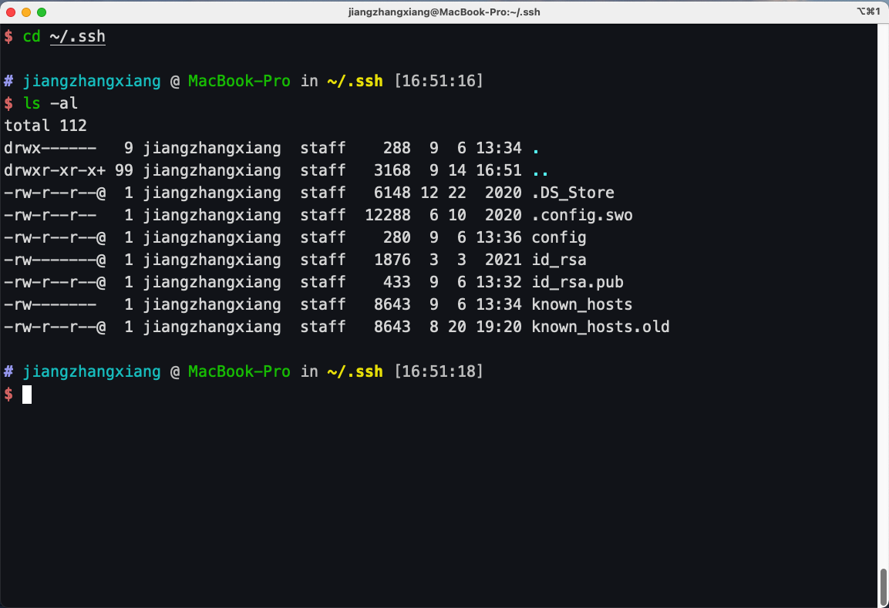

## Mac配置ssh密钥登录Linux
#### ssh登录Linux通常有两种方法：
1. 用户名、密码 登录（使用用户名密码登录每次都要输入密码，相当麻烦）
2. 用户名、密钥 登录（不需要输入秘密）

## 创建密钥对文件
打开本地终端，执行 `ssh-keygen` 命令创建密钥对：
```
ssh-keygen -t rsa -C  'your email@domain.com'

-t 指定密钥类型，默认即 rsa ，可以省略
-C 设置注释文字，比如你的邮箱，可以省略
```

生成过程中会提示输入密码两次，如果不想在使用公钥的时候输入密码，可以回车跳过；
密钥默认保存位置在 `~/.ssh` 目录下，打开后会看到私钥文件 `id_rsa` 和公钥文件 `id_rsa.pub`



## 复制公钥至服务器
使用 scp 命令将本地的公钥文件 `id_rsa.pub` 复制到需要连接的Linux服务器：

```
scp ~/.ssh/id_rsa.pub <用户名>@<ip地址>:/home/id_rsa.pub
```

如果修改了ssh默认连接端口的话，需要加上端口信息：

```
scp -P <端口号> ~/.ssh/id_rsa.pub <用户名>@<ip地址>:/home/id_rsa.pub
```

把公钥追加到服务器ssh认证文件中：

```
cat /home/id_rsa.pub >> ~/.ssh/authorized_keys
```

> 做以上步骤 就是为了将本地的 ~/.ssh/id_rsa.pub 内容 追加到 远程服务器 的 ~/.ssh/authorized_keys 中

这时候在本地终端中使用用户名和ip登录就不需要密码了：

```
ssh <用户名>@<ip>
```

如果修改了ssh默认连接端口的话，需要加上端口信息：

```
ssh -p <端口号> <用户名>@<ip地址>
```

## 配置快捷登录
即使不用输入密码，这样每次登录还要输入用户名ip端口信息还是有点麻烦，我们可以配置ssh快捷登录更方便的登录Linux；
在本地 `~/.ssh/config` 配置文件中添加ssh服务器信息，格式：

```
Host            alias            #自定义别名
HostName        hostname         #替换为你的ssh服务器ip或domain
Port            port             #ssh服务器端口，默认为22
User            user             #ssh服务器用户名
IdentityFile    ~/.ssh/id_rsa    #第一个步骤生成的公钥文件对应的私钥文件
```

这时候就可以使用配置文件中自定义的别名来登录了
